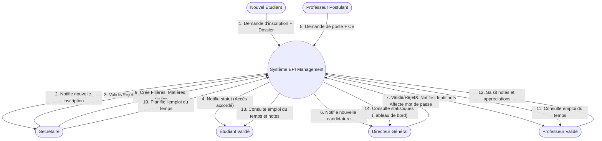

# Graphe des Flux (Modèle Conceptuel de Communication)

Le graphe des flux représente les échanges d'informations entre les différents acteurs (internes et externes) du système de gestion scolaire EPI Management.

## Acteurs du système
- **Acteurs externes :** Candidat / Nouvel Étudiant, Professeur (Candidat)
- **Acteurs internes :** Secrétaire, Directeur Général (DG), Étudiant (Validé), Professeur (Validé), Système

## Diagramme des Flux (Mermaid)

## Description des Flux Principaux

1. **Processus d'Inscription (Flux 1 à 4) :**
   Un candidat soumet son dossier en ligne. Le Secrétaire analyse les informations. Si le dossier est validé, le compte de l'étudiant devient actif et il peut accéder à son portail.

2. **Processus de Recrutement Enseignant (Flux 5 à 8) :**
   Un candidat professeur s'inscrit sur la plateforme. Son profil reste inactif (statut "En attente") jusqu'à ce que le Directeur Général (DG) examine son dossier, valide sa candidature et lui génère un mot de passe pour accéder à son espace.

3. **Planification Académique (Flux 9 à 10) :**
   Le Secrétaire est l'architecte de la structure académique. Il configure les Salles, les Filières, les Matières, et gère l'emploi du temps via l'interface interactive (Drag & Drop).

4. **Saisie des Notes (Flux 11 à 12) :**
   Le Professeur se connecte, voit ses classes assignées (via l'emploi du temps), et saisit les notes de ses étudiants. 

5. **Consultation & Supervision (Flux 13 à 14) :**
   Les Étudiants se connectent pour voir leurs résultats scolaires et l'emploi du temps. Le DG dispose d'un tableau de bord global pour superviser l'ensemble des activités.
