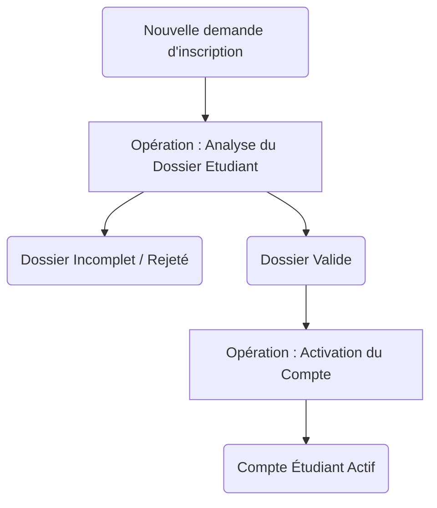
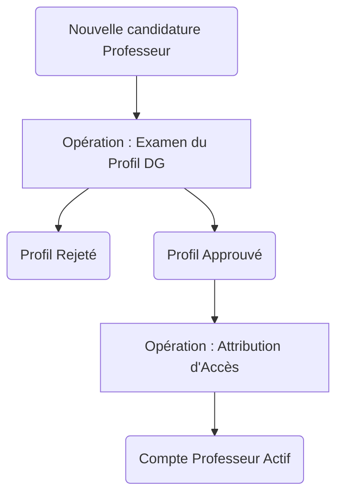
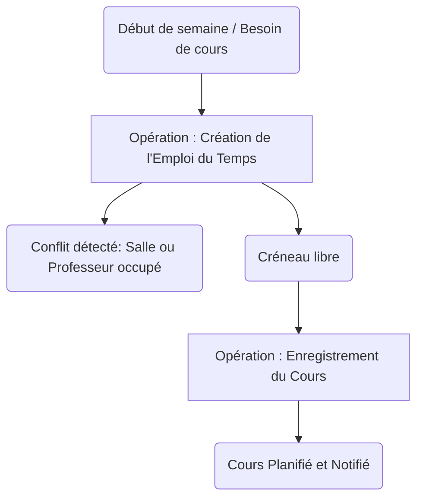
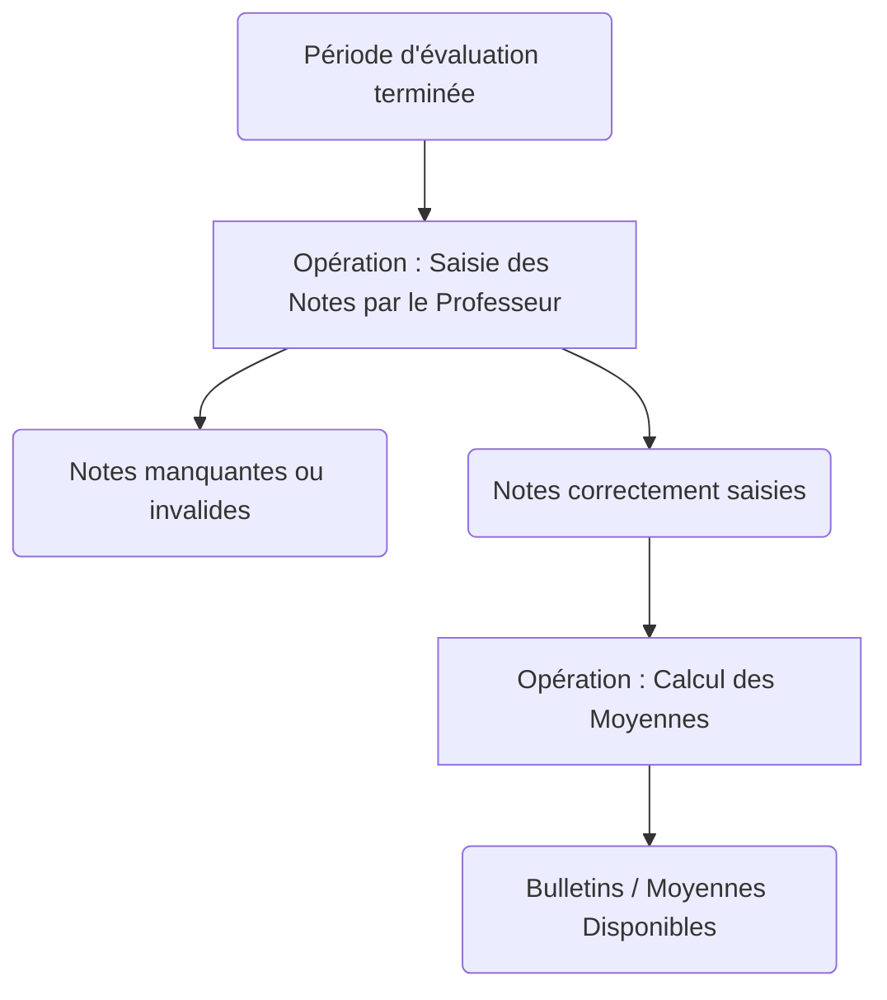

# Modèle Conceptuel des Traitements (MCT)

Le Modèle Conceptuel des Traitements décrit les actions menées par le système en réponse à des événements externes, sans se soucier de qui fait quoi ni comment.

## Processus 1 : Inscription d'un Étudiant

**Règles d'émission :**
- L'opération "Analyse du Dossier" est déclenchée lors de la réception d'une inscription.
- L'opération "Activation du Compte" est déclenchée si le statut d'analyse est "Validé".

## Processus 2 : Validation d'un Professeur

**Règles d'émission :**
- Le DG reçoit les candidatures en attente.
- L'approbation d'un profil déclenche l'attribution d'un mot de passe et l'ouverture des accès.

## Processus 3 : Planification des Cours

**Règles d'émission :**
- Le système vérifie la disponibilité de la Salle et du Professeur pour l'heure indiquée.
- Si le créneau est disponible, le cours est enregistré dans `planning_cours`.

## Processus 4 : Évaluation (Saisie des Notes)

**Règles d'émission :**
- Le professeur saisit les notes pour les matières qu'il enseigne.
- Le calcul de la moyenne de l'étudiant tient compte du coefficient (`coefficient`) de chaque matière.
