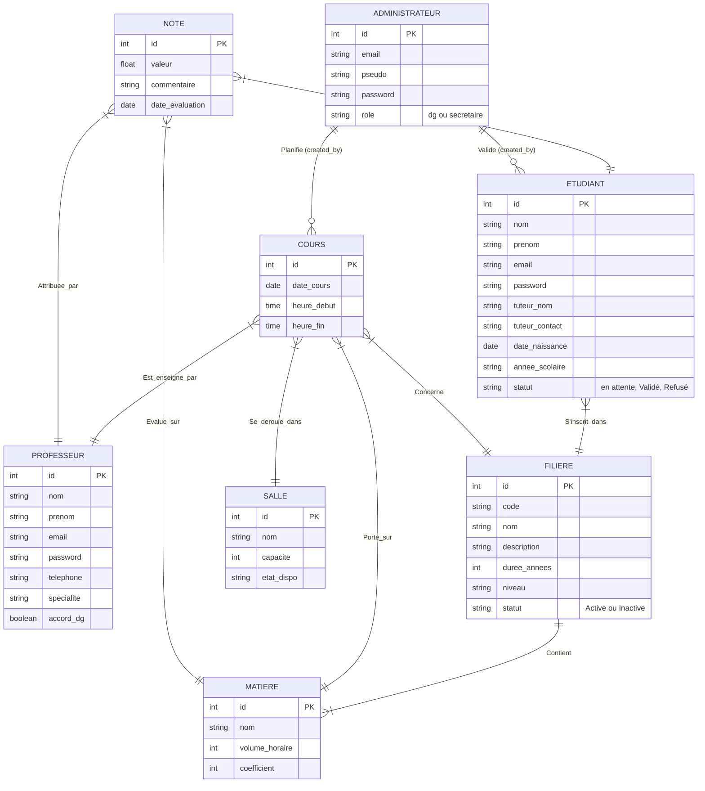

# Modèle Conceptuel des Données (MCD)

Le MCD permet de représenter la structure des données du système d'information de manière abstraite.

## Entités et Associations (Diagramme ER)

## Description des Associations

1. **S'inscrit_dans** : Un étudiant est rattaché à une et une seule filière. Une filière peut accueillir plusieurs étudiants (1,N).
2. **Contient** : Une filière est composée d'une ou plusieurs matières. Une matière appartient à une filière spécifique (1,1).
3. **Planification (Cours)** : Un cours est le croisement (association) entre une Filière, une Matière, un Professeur, une Salle, et des créneaux horaires.
4. **Évaluation (Note)** : Une note est attribuée à un Étudiant, pour une Matière donnée, par un Professeur donné.
